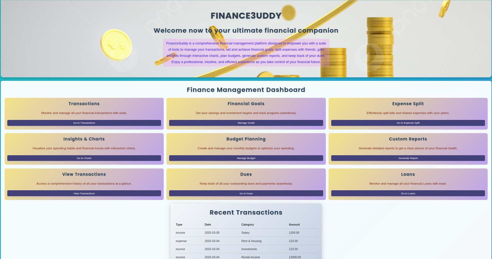
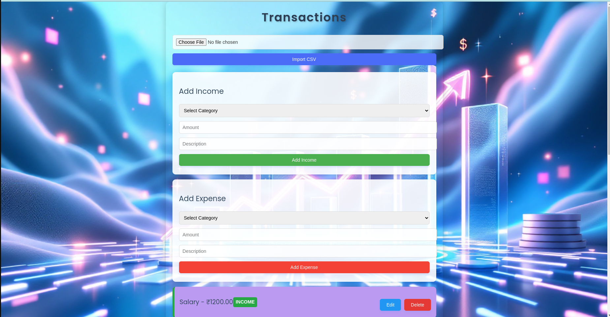
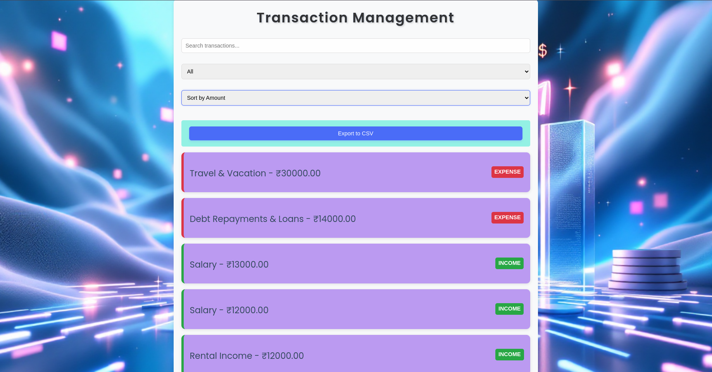
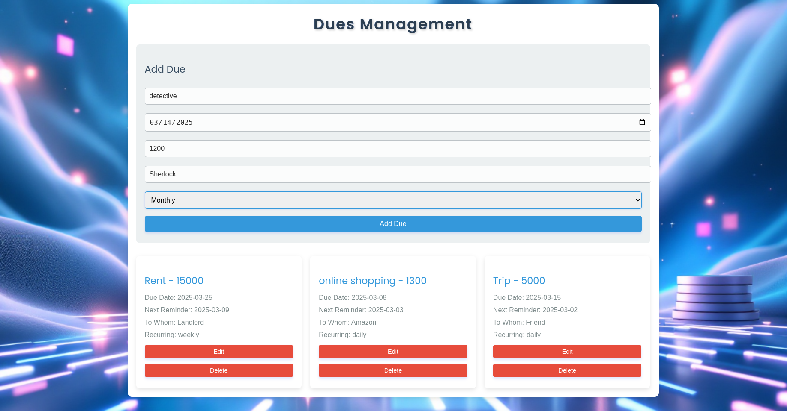
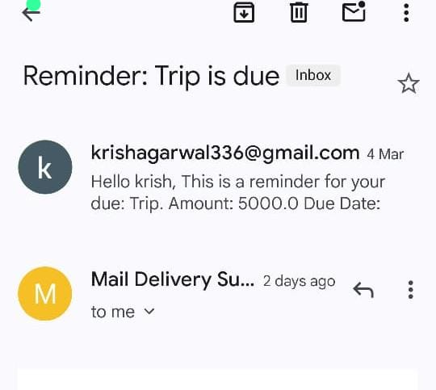
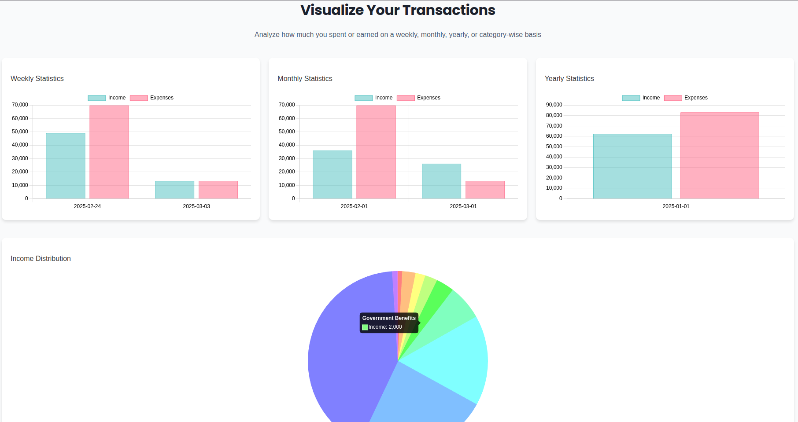
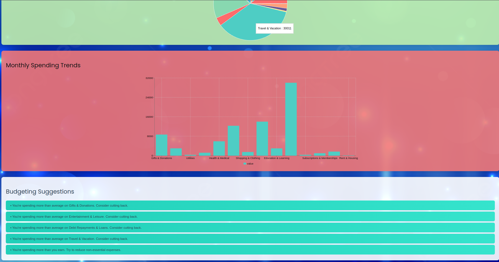
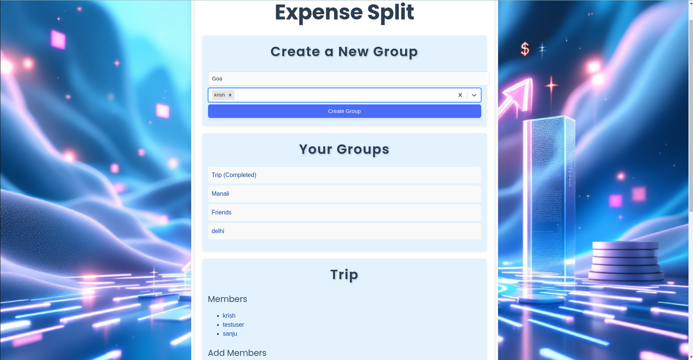
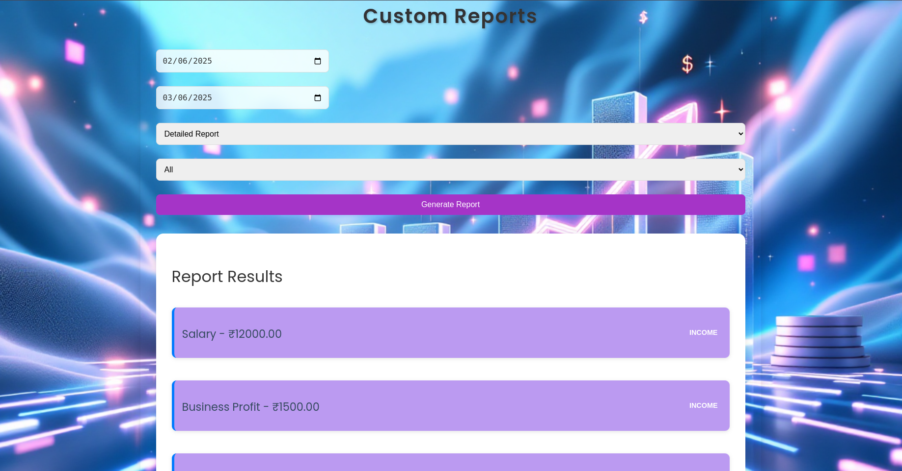

---

# Finance3uddy  

## Personal Finance Management Platform  

### Objective  
Finance3uddy is a web-based Personal Finance Management Platform designed to help users efficiently track, analyze, and manage their income, expenses, and transactions. The platform provides tools for budgeting, financial insights, and transaction organization to assist users in making informed financial decisions.  

---

## 🚀 Live Deployment  
- **Backend**: [Finance3uddy Backend](https://finance3uddy-2.onrender.com/)  
- **Frontend**: [Finance3uddy Frontend](https://regal-gelato-af0006.netlify.app/)  

---

## Features  

### 🏠 User-Friendly Dashboard  
- Intuitive UI displaying key metrics such as total income, expenses, and savings.  

  

### 💰 Income and Expense Tracking  
- Users can add(import bank statements via CSV files), edit, and categorize income and expenses (e.g., rent, groceries, entertainment). 

  

### 📂 Transaction Management  
- Search, filter, and sort transactions by date, category, or amount for better financial organization.  
- Users can export data for offline use or tax purposes via csv files.  

  

### 🔒 Data Security & Authentication  
- Secure user authentication and financial data storage using Django authentication and Google OAuth.  

  

### 🔔 Notifications & Bill Reminders  
- Alerts for upcoming payments and bills.  

  



### 🎯 Financial Goal Setting  
- Users can set savings goals and track their progress.  
  

### 📊 Graphs and Visualizations  
- Interactive charts display financial trends, monthly summaries, and expense breakdowns. 

  

### ⚡ Optional Features  
- **Smart Budgeting** – Suggestions based on spending patterns.  

    
  
- **Expense Splitting** – Allow users to split expenses with friends, track shared costs, and settle balances easily.  

    

- **Custom Reports** – Generate personalized reports for financial planning or tax purposes.

    

- **Loans** – Users can see the details of their loans.  

    

---

## 🛠 Tech Stack  
- **Backend**: Django (Python)  
- **Frontend**: React (JavaScript)  
- **Database**: PostgreSQL  
- **Authentication**: Django Authentication & Google OAuth  
- **Data Visualization**: Chart.js  

---

## 📥 Installation & Setup  

### Prerequisites  
Ensure you have the following installed:  
- Python (>=3.8)  
- Node.js (>=16)  
- PostgreSQL (if using a production database)  

### 🔧 Backend Setup (Django)  
```bash
# Clone the repository
git clone https://github.com/rsnj5/finance3uddy.git
cd finance3uddy/backend

# Create virtual environment
python -m venv env
source env/bin/activate  # On Windows: env\Scripts\activate

# Install dependencies
pip install -r requirements.txt

# Apply migrations
python manage.py migrate

# Create a superuser (optional)
python manage.py createsuperuser

# Run the server
python manage.py runserver
```

### 🎨 Frontend Setup (React)  
```bash
cd ../frontend

# Install dependencies
npm install

# Start the development server
npm start
```

### 🚀 Running the Project  
- The backend will be available at `http://127.0.0.1:8000/`  
- The frontend will run at `http://localhost:3000/`  

---

## 🔑 Environment Variables  
Create a `.env` file in the `backend/` directory and configure the following variables:  
```
SECRET_KEY=your_secret_key
DEBUG=True
DATABASE_URL=your_database_url
```
Similarly, for the frontend, create a `.env` file in `frontend/`:  
```
REACT_APP_API_URL=http://127.0.0.1:8000/
```

---

## 📡 API Endpoints  
| Endpoint | Method | Description |  
|----------|--------|-------------|  
| `/api/auth/` | Include | Authentication endpoints |  
| `/api/auth/registration/` | Include | User registration via dj-rest-auth |  
| `/api/auth/google/` | Include | Google authentication via allauth |  
| `/api/token/` | POST | Obtain JWT token |  
| `/api/token/refresh/` | POST | Refresh JWT token |  
| `/api/users/authorized/` | GET | Get authorized users |  
| `/api/transactions/` | Include | Manage transactions |  
| `/api/goals/` | Include | Manage financial goals |  
| `/api/expensesplit/` | Include | Manage expense splitting |  
| `/api/dues/` | Include | Manage dues and payments |  
| `/api/loans/` | Include | Manage loans |  

---

## 🤝 Contributing  
1. Fork the repository  
2. Create a feature branch: `git checkout -b feature-branch`  
3. Commit your changes: `git commit -m "Add new feature"`  
4. Push to the branch: `git push origin feature-branch`  
5. Open a pull request  

---

## 📜 License  
This project is licensed under the **MIT License**.  

---

